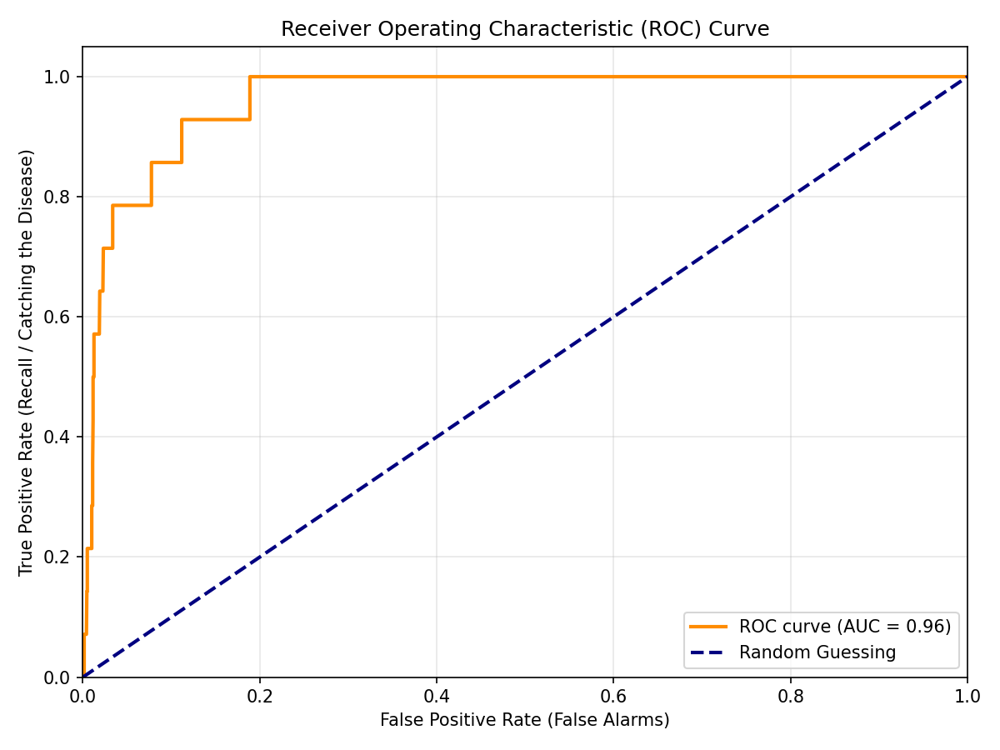
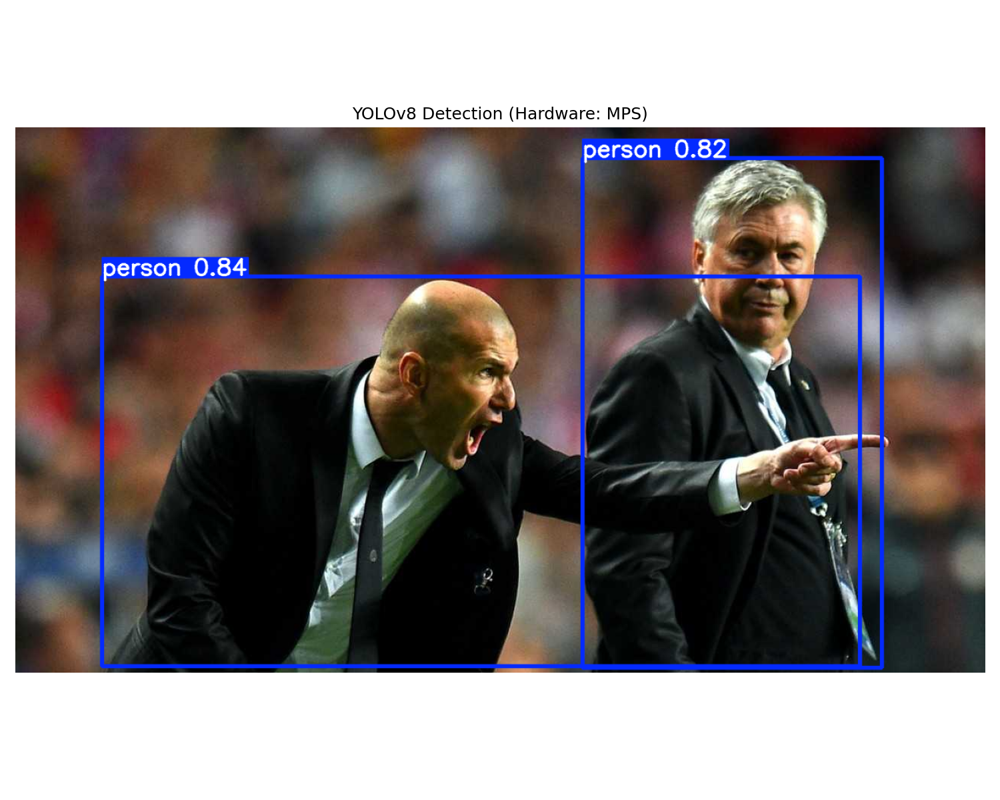

# 60-Day AIML Engineering Journey 🚀

This repository tracks my transition into an AIML Engineer.  
Built from scratch — focusing on a privacy-first, 100% local Retrieval-Augmented Generation (RAG) system running natively on Apple Silicon.

---

## 🛠 Tech Stack

| Category | Tools |
|---|---|
| **Hardware** | MacBook Pro M5 (16GB RAM, 512GB SSD) |
| **Shell** | Bash / Zsh |
| **Version Control** | Git, GitHub, `.gitignore` configuration |
| **Core ML Engines** | Apple MLX, PyTorch (Metal Performance Shaders) |
| **Transformer Tooling** | Hugging Face Transformers, Tokenizers, Sentence Transformers |
| **Local LLMs** | TinyLlama, Qwen2.5, MLX-LM |
| **Computer Vision** | Ultralytics YOLOv8, OpenCV |
| **Data Engineering** | Python 3.11, NumPy, Pandas |
| **Data Visualization** | Matplotlib, Seaborn |
| **Classical ML** | Scikit-learn, XGBoost, imbalanced-learn |
| **Vector Database** | ChromaDB |
| **Environment Management** | Python `venv`, pip requirements |
| **Editor** | VS Code (with Python & Jupyter extensions) |

---

## 📈 Learning Progress

## 🏗️ Phase 1: Environment & Mathematical Foundations (Days 1–10)

- [x] **Day 1:** Environment & Hardware Verification - Configure Python/VS Code and verify Apple MLX plus PyTorch MPS on Apple Silicon.
- [x] **Day 2:** Data Engineering Foundation - Generate synthetic clinical biomarkers with NumPy and clean/filter patient records with Pandas.
- [x] **Day 3:** Multi-Dimensional Matrices & Dot Products - Simulate semantic matching with Apple MLX.
- [x] **Day 4:** MLX Autograd & Calculus Engine - Calculate loss values and gradients for backpropagation intuition.
- [x] **Day 5:** Healthcare Dataset EDA - Load a local healthcare dataset with Pandas and inspect shape, preview rows, and missing values.
- [x] **Day 6:** Data Cleaning & RAG Text Serialization - Impute missing BMI values and convert patient rows into natural-language profiles.
- [x] **Day 7:** Local Vector Database - Initialize ChromaDB, embed patient profiles, and run semantic retrieval queries.
- [x] **Day 8:** MLX Backpropagation Engine - Train a simple weight with scalar loss, gradients, and gradient descent.
- [x] **Day 9:** Matplotlib & Seaborn EDA - Generate clinical summary statistics, distributions, scatter plots, and correlation heatmaps.
- [x] **Day 10:** Real-World Data Cleaning & EDA - Sanitize messy clinical records, impute missing values, remove outliers, and visualize diagnosis counts.

## 📊 Phase 2: Classical Machine Learning (Days 11–20)

- [x] **Day 11:** Linear Regression - Train a continuous blood pressure predictor with Scikit-learn.
- [x] **Day 12:** Logistic Regression - Train a binary hypertension classifier and inspect confusion matrix errors.
- [x] **Day 13:** Decision Trees - Train an interpretable priority follow-up classifier and visualize its split rules.
- [x] **Day 14:** Random Forests - Train an ensemble classifier for patient readmission and inspect feature importance.
- [x] **Day 15:** Gradient Boosting - Train an XGBoost diabetes-risk classifier with sequential tree boosting.
- [x] **Day 16:** Advanced XGBoost - Tune gradient boosting hyperparameters with randomized cross-validation.
- [x] **Day 17:** Unsupervised Learning - Segment unlabeled patients with K-Means clustering.
- [x] **Day 18:** Unsupervised Learning - Reduce high-dimensional medical data with Principal Component Analysis (PCA).
- [x] **Day 19:** Model Evaluation - Evaluate imbalanced rare-disease detection with Precision, Recall, F1-score, and ROC-AUC.
- [x] **Day 20:** ML Pipelines - Build an end-to-end SMOTE and Random Forest pipeline with threshold tuning.

## 🧠 Phase 3: Deep Learning & Embeddings (Days 21–30)

- [x] **Day 21:** PyTorch Fundamentals - Create tensors, bridge NumPy arrays, run matrix multiplication, and reshape data.
- [x] **Day 22:** Multi-Layer Perceptron (MLP) - Build a PyTorch `nn.Module` patient-risk network and run a forward pass.
- [x] **Day 23:** Hardware Acceleration - Move large tensors to Apple Silicon MPS and benchmark CPU vs GPU matrix multiplication.
- [x] **Day 24:** Neural Network Training - Train a PyTorch risk model with forward passes, BCE loss, backpropagation, and Adam on MPS.
- [x] **Day 25:** Transformers - Implement self-attention from scratch with Q/K/V tensors, dot products, softmax weights, and context-aware outputs.
- [x] **Day 26:** Hugging Face - Load a pre-trained DistilBERT model with the pipeline API and manual tokenizer/model inference.
- [x] **Day 27:** NLP Processing - Tokenize batches of medical notes with padding, truncation, attention masks, and decoded special tokens.
- [x] **Day 28:** Vectorization - Convert clinical text into dense sentence embeddings with MiniLM mean pooling and cosine similarity.
- [x] **Day 29:** Lightweight Models - Benchmark MiniLM vs BGE-Small sentence embedding models on a simulated medical corpus.
- [x] **Day 30:** Vector Databases - Persist BGE-Small embeddings in ChromaDB and run semantic RAG retrieval.

## 👁️ Phase 4: Local Generation, Vision & The MLX Engine (Days 31–40)

- [x] **Day 31:** Local LLM Text Generation - Run TinyLlama locally with Hugging Face text-generation on Apple Silicon MPS.
- [x] **Day 32:** Native Computer Vision - Run YOLOv8 object detection on Apple Silicon and save annotated detections.
- [x] **Day 33:** Prompt Templates - Compare Llama-3 and Mistral chat template formatting for medical assistant prompts.
- [x] **Day 34:** Memory Optimization - Compare synchronized PyTorch eager execution with Apple MLX lazy evaluation.
- [x] **Day 35:** The Apple MLX LLM - Run native MLX-LM text generation with a 4-bit Qwen2.5 model.
- [x] **Day 36:** Model Quantization - Convert TinyLlama from Hugging Face weights into a local 4-bit MLX model.
- [x] **Day 37:** Downloading Quantized Models - Load a community 4-bit Llama-3 model with MLX-LM for local inference.
- [x] **Day 38:** Local Inference - Build an interactive streaming chat loop with conversation memory and context trimming.
- [ ] **Day 39:** Hardware Acceleration - Taking full advantage of the M5 neural engine.
- [ ] **Day 40:** Inference Optimization - Tuning generation parameters, including temperature and max tokens.

## ⚙️ Phase 5: Building Agentic RAG (Days 41–50)

- [ ] **Day 41:** Document Ingestion - Setting up a LangChain pipeline.
- [ ] **Day 42:** PDF Parsing - Reading and extracting text from clinical PDFs.
- [ ] **Day 43:** Chunking - Splitting documents into optimized semantic chunks.
- [ ] **Day 44:** Embedding Generation - Batch processing chunks into vectors.
- [ ] **Day 45:** Vector Storage Setup - Initializing the RAG database.
- [ ] **Day 46:** Populating ChromaDB - Inserting chunked embeddings securely.
- [ ] **Day 47:** Semantic Search - Querying the database for nearest neighbors.
- [ ] **Day 48:** Orchestration Logic - Programming the agentic retrieval step.
- [ ] **Day 49:** LLM Integration - Instructing the MLX LLM to read chunks and formulate answers.
- [ ] **Day 50:** RAG Fusion - End-to-end testing of the question-answering loop.

## 🚀 Phase 6: Fine-Tuning, UI & Deployment (Days 51–60)

- [ ] **Day 51:** PEFT & LoRA - Introduction to Parameter-Efficient Fine-Tuning.
- [ ] **Day 52:** Corporate Jargon - Preparing a dataset of specific medical terminology.
- [ ] **Day 53:** MLX Fine-Tuning - Running LoRA on the quantized model within 16GB limits.
- [ ] **Day 54:** Merging Weights - Applying the LoRA adapters to the base model.
- [ ] **Day 55:** User Interface - Introduction to Streamlit.
- [ ] **Day 56:** UI Development - Building a modern browser-based chat interface.
- [ ] **Day 57:** UI Integration - Connecting the Streamlit frontend to the RAG backend.
- [ ] **Day 58:** Profiling - Reviewing memory usage across the complete pipeline.
- [ ] **Day 59:** Optimization - Tweaking chunk sizes and prompts to maximize M5 generation speed.
- [ ] **Day 60:** Shipping - Finalizing `README.md` documentation and pushing to GitHub.

---

## ✅ Current Status

Day 38 is complete. Phase 4 now includes local Hugging Face text generation, YOLOv8 object detection on Apple Silicon, model-specific prompt template formatting, Apple MLX lazy-evaluation optimization, native MLX-LM generation, local 4-bit model quantization, pre-quantized Llama-3 inference with MLX-LM, and an interactive local streaming chat loop. The project now has:

- `day1_test_env.py` for validating Apple Silicon ML acceleration with PyTorch MPS and Apple MLX.
- `day2_data_engine.py` for generating synthetic patient biomarker data, imputing missing clinical fields, and filtering high-risk hypertension records.
- `day3_vector_math.py` for simulating clinical semantic similarity with dot products and MLX matrix multiplication.
- `day4_calculus_engine.py` for validating MLX autograd by calculating a loss function gradient.
- `day5_eda.py` for running exploratory data analysis on the local healthcare dataset.
- `day6_data_cleaning.py` for imputing missing BMI values and creating patient text profiles for future RAG embeddings.
- `day7_vector_db.py` for initializing a local ChromaDB collection and retrieving semantically similar patient profiles.
- `day8_calculus_engine.py` for demonstrating MLX autograd, scalar loss calculation, and gradient descent updates.
- `day9_eda.py` for generating synthetic clinical EDA summaries with Matplotlib and Seaborn visualizations.
- `day10_real_eda.py` for cleaning messy real-world-style clinical data and visualizing cleaned diagnosis distributions.
- `day11_linear_regression.py` for training and evaluating a Scikit-learn linear regression model on synthetic patient blood pressure data.
- `day12_logistic_regression.py` for training a Scikit-learn logistic regression classifier and analyzing true/false positives and negatives.
- `day13_decision_trees.py` for training a Scikit-learn decision tree classifier and visualizing the learned clinical split logic.
- `day14_random_forest.py` for training a Scikit-learn random forest readmission classifier and plotting feature importances.
- `day15_xgboost_classifier.py` for training an XGBoost diabetes-risk classifier and testing an edge-case patient.
- `day16_xgboost_tuning.py` for tuning an XGBoost regressor with randomized search and cross-validation.
- `day17_kmeans_clustering.py` for segmenting unlabeled patients into discovered clinical clusters with K-Means.
- `day18_pca_reduction.py` for reducing 30-dimensional medical measurements into two principal components for visualization.
- `day19_model_evaluation.py` for evaluating an imbalanced rare-disease classifier with precision, recall, F1-score, and ROC-AUC.
- `day20_pipeline_optimization.py` for chaining SMOTE and Random Forest in an imbalanced-learn pipeline with threshold tuning.
- `day21_pytorch_tensors.py` for creating PyTorch tensors, converting NumPy arrays, running neural-network-style matrix multiplication, and reshaping tensor data.
- `day22_mlp_network.py` for defining a PyTorch multi-layer perceptron with hidden layers, ReLU activations, sigmoid output, and a mock patient forward pass.
- `day23_hardware_acceleration.py` for moving large PyTorch tensors to Apple Silicon MPS and comparing synchronized CPU vs GPU matrix multiplication timing.
- `day24_nn_training.py` for training a PyTorch neural network on synthetic patient-risk data with BCE loss, backpropagation, and the Adam optimizer on MPS.
- `day25_self_attention.py` for implementing transformer-style self-attention from scratch with query, key, value tensors, attention weights, and context-aware outputs.
- `day26_huggingface_intro.py` for using Hugging Face Transformers through the high-level pipeline API and the manual tokenizer/model inference path.
- `day27_nlp_processing.py` for tokenizing batches of medical notes with BERT, padding variable-length text, building attention masks, and decoding special tokens.
- `day28_embeddings.py` for generating MiniLM sentence embeddings with mean pooling and comparing clinical concepts with cosine similarity.
- `day29_model_benchmarking.py` for benchmarking MiniLM and BGE-Small embedding models on a 500-document simulated medical corpus.
- `day30_chromadb_rag.py` for persisting BGE-Small clinical embeddings in ChromaDB and retrieving the nearest medical record for a natural-language doctor query.
- `day31_text_generation.py` for running TinyLlama locally through the Hugging Face text-generation pipeline and generating a medical assistant response.
- `day32_yolo_vision.py` for downloading a sample vision image, running YOLOv8-Nano object detection on MPS, and saving annotated bounding boxes.
- `day33_prompt_templates.py` for comparing Llama-3 and Mistral chat template strings generated from the same medical assistant conversation.
- `day34_mlx_optimization.py` for comparing PyTorch eager matrix execution against MLX lazy graph construction and optimized evaluation.
- `day35_mlx_llm.py` for loading a 4-bit Qwen2.5 Instruct model with MLX-LM and generating local text through Apple MLX.
- `day36_mlx_quantize.py` for converting TinyLlama Hugging Face weights into a local 4-bit MLX model.
- `day37_llama3_quantized.py` for loading a community 4-bit Llama-3 model with MLX-LM and generating a clinical reasoning response.
- `day38_local_inference.py` for running an interactive streaming medical-assistant chat session with conversation history and context-window trimming.
- `Figure_1.png` as the Day 9 EDA dashboard image with an age histogram, BMI/BP scatter plot, and correlation heatmap.
- `Figure_2.png` as the Day 10 cleaned diagnosis count chart.
- `Decision_Tree.jpeg` and `Figure_3.png` as Day 13 decision tree visualization artifacts.
- `Figure_4.png` as the Day 14 random forest feature-importance chart.
- `Figure_5.png` as the Day 17 K-Means patient segmentation chart.
- `Figure_6.png` as the Day 18 PCA dimensionality-reduction chart.
- `Figure_7.png` as the Day 19 ROC curve for rare-disease model evaluation.
- `YOLO_V8.png` as the Day 32 YOLOv8 object-detection visualization artifact.
- `healthcare_dataset.csv` as the local source dataset used by the Day 5 and Day 6 scripts.
- `cleaned_healthcare_data.csv` as the cleaned Day 6 output dataset with serialized patient profiles.
- `requirements.txt` with the Day 1 through Day 38 Python dependencies.
- `clinical_vector_db/` as a local ignored ChromaDB runtime artifact generated by the Day 30 script.
- `yolov8n.pt` and `sample_vision.jpg` as ignored runtime artifacts generated by the Day 32 script.
- `mlx_model/` as an ignored local MLX runtime artifact generated by the Day 36 quantization script.

## 📂 Project Highlights

### ⚙️ Day 1 Hardware Verification (`day1_test_env.py`)

A sanity check script ensuring PyTorch communicates with the M5 GPU (MPS) and Apple MLX is successfully initialized.

```bash
python day1_test_env.py
# --- Apple Silicon Hardware Test ---
# ✅ PyTorch is successfully utilizing the M5 GPU (MPS).
# ✅ Apple MLX is installed and functioning.
```

---

### 🧬 Clinical Data Engine (`day2_data_engine.py`)

Simulates clinical dataset manipulation for future RAG ingestion. Demonstrates fast NumPy array processing for patient biomarkers and Pandas DataFrame imputation for missing values in clinical notes.

```bash
python day2_data_engine.py
# --- Day 2: Clinical Data Engineering Engine ---
#
# Step 1: Raw NumPy Biomarker Matrix (Shape: 5x3):
# [[148 138 124] ... ]
#
# Step 3: Imputed missing ages with median (48.5):
#     Patient_ID   Age     Condition                                     Clinical_Notes
# 0          101  45.0  Hypertension  Patient exhibits elevated resting systolic pressure.
#
# Step 4: Filtered High-Risk Hypertension Patients:
#     Patient_ID   Age                                     Clinical_Notes
# 0          101  45.0  Patient exhibits elevated resting systolic pressure.
# 3          104  61.0              Severe chronic hypertension tracking.
```

---

### 🧮 Clinical Vector Math (`day3_vector_math.py`)

Simulates semantic matching for clinical terms using Apple MLX vectors, dot products, and matrix multiplication. This is the foundation for future embedding search and local RAG retrieval.

```bash
python day3_vector_math.py
# --- Day 3: Clinical Semantics & Matrix Engines ---
#
# Dot Product (Hypertension vs Blood Pressure): 0.74
# Dot Product (Hypertension vs Diabetes):       0.17
#
# Step 3: MLX Accelerated Patient Diagnosis Matrix (Patients x Diseases):
# array([[0.779552, 0.204833],
#        [0.134952, 0.729741]], dtype=float32)
```

---

### 📉 MLX Calculus Engine (`day4_calculus_engine.py`)

Uses Apple MLX autograd to calculate the value and gradient of a simple loss function. This connects calculus basics to the mechanism behind neural network backpropagation.

```bash
python day4_calculus_engine.py
# --- MLX Calculus Engine ---
# Input value (x): 2.0
# Calculated Loss: 17.0
# Calculated Gradient (Rate of Change): 14.0
```

---

### 📊 Healthcare Dataset EDA (`day5_eda.py`)

Loads the local healthcare dataset with Pandas, confirms the record and feature counts, previews patient rows, and checks for missing values before future cleaning and modeling steps.

```bash
python day5_eda.py
# --- Healthcare Dataset EDA Engine (Local) ---
# Dataset successfully loaded from local file!
#
# Total Patient Records (Rows): 5110
# Total Features (Columns): 12
#
# --- Missing Data Check ---
# Warning: Missing data found in the following columns:
# bmi    201
```

---

### 🧹 Healthcare Data Cleaning (`day6_data_cleaning.py`)

Imputes missing BMI values with the median, verifies that no BMI nulls remain, and serializes each patient record into a natural-language profile suitable for later embedding and RAG retrieval work.

```bash
python day6_data_cleaning.py
# --- Healthcare Data Cleaning Pipeline ---
# Fixed 201 missing values by imputing the median BMI: 28.1
# Missing BMI values remaining: 0
#
# Converting patient records into text profiles...
# Success! Cleaned data saved to: cleaned_healthcare_data.csv
```

---

### 🔎 Local Vector Database (`day7_vector_db.py`)

Initializes an in-memory ChromaDB collection, embeds sample patient profiles, and performs semantic search with a natural-language query to simulate the retrieval layer of a future RAG assistant.

```bash
python day7_vector_db.py
# --- Day 7: ChromaDB Vector Engine Initialization ---
#
# Embedding and loading patient records into Vector Database...
# Records successfully stored in ChromaDB.
#
# Searching Vector DB for: 'elderly patients struggling with high blood pressure'
# Top 2 Semantic Matches Found:
# Match 1: Patient 101 ... Diagnosed with Hypertension.
# Match 2: Patient 102 ... Severe chronic hypertension tracking.
```

---

### 📐 MLX Backpropagation Engine (`day8_calculus_engine.py`)

Trains a simple one-weight model with MLX autograd. The script computes mean squared error as a scalar loss, reads the gradient with `mx.value_and_grad`, and updates the weight through gradient descent until it approaches the ideal value.

```bash
python day8_calculus_engine.py
# --- Day 8: MLX Autograd & Backpropagation Engine ---
#
# Starting Training Loop...
# Epoch 01 | Weight: 1.0000 | Loss: 64.0000 | Gradient (Slope): -32.0000
# Epoch 10 | Weight: 4.9597 | Loss: 0.0065 | Gradient (Slope): -0.3225
#
# Training Complete. The model optimized the weight to: 4.9758 (Ideal is 5.000)
```

---

### 📊 Clinical EDA Dashboard (`day9_eda.py`)

Generates a synthetic clinical dataset, prints summary statistics, and builds a three-panel EDA dashboard with patient age distribution, BMI versus systolic blood pressure, and a feature correlation heatmap.


```bash
python day9_eda.py
# --- Day 9: Healthcare Exploratory Data Analysis (EDA) ---
#
# Dataset Summary Statistics:
#          Age     BMI  Systolic_BP
# count  496.00  496.00       496.00
# mean    54.57   28.15       131.20
#
# Generating Visualizations... Check your taskbar/dock for new windows!
```

---

### 🧼 Real-World Data Cleaning EDA (`day10_real_eda.py`)

Simulates a messy Kaggle-style clinical CSV, inspects raw issues, standardizes diagnosis labels, removes impossible age outliers, imputes missing age and blood pressure values, and saves a cleaned diagnosis distribution chart.


```bash
python day10_real_eda.py
# --- Day 10: Real-World Data Cleaning & EDA ---
#
# RAW DATA includes impossible ages, NaNs, and inconsistent diagnosis casing.
# CLEANED DATA keeps valid patients, standardizes labels, and fills missing values.
#
# Generating chart... Saved to: Figure_2.png
```

---

### 📈 Linear Regression Predictor (`day11_linear_regression.py`)

Generates synthetic patient age, BMI, and systolic blood pressure data, splits the dataset into training and testing sets, trains a Scikit-learn `LinearRegression` model, evaluates prediction error, and runs inference for a new patient.

```bash
python day11_linear_regression.py
# --- Day 11: Linear Regression Prediction Model ---
#
# Data Split: 800 Training Patients | 200 Testing Patients
# Learned Weights -> Age Multiplier: 0.39, BMI Multiplier: 1.06
# Evaluation: On average, the model's predictions are off by 3.63 mmHg.
# Predicted Systolic Blood Pressure: 133.1
```

---

### 🧪 Logistic Regression Classifier (`day12_logistic_regression.py`)

Generates synthetic patient risk data, scales age, BMI, and heart-rate features, trains a Scikit-learn `LogisticRegression` classifier, evaluates accuracy, and breaks down confusion matrix errors for hypertension classification.

```bash
python day12_logistic_regression.py
# --- Day 12: Logistic Regression Classifier ---
#
# Dataset Balance: 731 patients with Hypertension, 269 Healthy
# Overall Model Accuracy: 84.50%
# True Negatives: 39 | False Positives: 18
# False Negatives: 13 | True Positives: 130
# Prediction: Healthy
# AI Confidence (Probability): 32.6%
```

---

### 🌳 Decision Tree Classifier (`day13_decision_trees.py`)

Generates synthetic clinical follow-up data, trains a `DecisionTreeClassifier` without feature scaling, evaluates priority follow-up classification accuracy, and saves a visual tree diagram showing the model's split logic.


```bash
python day13_decision_trees.py
# --- Day 13: Decision Tree Classifier ---
#
# Dataset: 49 patients flagged for priority follow-up.
# Model Accuracy: 100.00%
# Saved tree visualizations to: Decision_Tree.jpeg and Figure_3.png
```

---

### 🌲 Random Forest Classifier (`day14_random_forest.py`)

Generates synthetic hospital readmission data, trains a 100-tree `RandomForestClassifier`, evaluates readmission classification performance, and saves a feature-importance chart showing which clinical variables the ensemble relied on most.


```bash
python day14_random_forest.py
# --- Day 14: Random Forest Classifier (Patient Readmission) ---
#
# Dataset: 335 patients were readmitted out of 1200.
# Forest Accuracy: 74.17%
# Healthy f1-score: 0.83 | Readmitted f1-score: 0.44
# Saved feature importance chart to: Figure_4.png
```

---

### ⚡ XGBoost Classifier (`day15_xgboost_classifier.py`)

Generates synthetic diabetes-risk data, trains an `XGBClassifier` with sequential gradient-boosted trees, evaluates the classifier, and runs inference on an edge-case patient with high blood sugar and BMI.

```bash
python day15_xgboost_classifier.py
# --- Day 15: XGBoost Classifier (Diabetes Risk Prediction) ---
#
# Dataset: 238 patients diagnosed out of 1500.
# XGBoost Accuracy: 83.67%
# Healthy f1-score: 0.91 | Diabetic f1-score: 0.20
# Prediction: Diabetic Risk
# AI Confidence (Probability): 64.4%
```

On macOS, XGBoost also needs the OpenMP runtime:

```bash
brew install libomp
```

---

### 🎛️ XGBoost Hyperparameter Tuning (`day16_xgboost_tuning.py`)

Generates synthetic treatment-cost data, trains a baseline `XGBRegressor`, then uses `RandomizedSearchCV` with cross-validation to find stronger hyperparameters and reduce average prediction error.

```bash
python day16_xgboost_tuning.py
# --- Day 16: Advanced XGBoost & Hyperparameter Tuning ---
#
# Baseline Error: Off by $2,347.03 per patient on average.
# Best parameters: n_estimators=100, max_depth=3, learning_rate=0.05
# Tuned Model Error: Off by $2,134.00 per patient on average.
# Financial Impact: Tuning saved $213.03 of error per prediction.
```

---

### 🧩 K-Means Patient Clustering (`day17_kmeans_clustering.py`)

Generates unlabeled clinical vitals, scales the features, uses `KMeans` to discover three hidden patient segments, summarizes each cluster's average vitals, and saves a 2D segmentation chart.


```bash
python day17_kmeans_clustering.py
# --- Day 17: Unsupervised Learning (K-Means Clustering) ---
#
# Received raw data for 450 patients. No diagnoses provided!
# Cluster 0: Age 70.5 | BMI 25.0 | Blood Pressure 135.7
# Cluster 1: Age 25.4 | BMI 21.8 | Blood Pressure 110.9
# Cluster 2: Age 50.4 | BMI 32.1 | Blood Pressure 145.5
# Saved cluster visualization to: Figure_5.png
```

---

### 🧬 PCA Dimensionality Reduction (`day18_pca_reduction.py`)

Loads Scikit-learn's breast cancer dataset, scales 30 tumor-measurement features, compresses them into two principal components, reports retained variance, and saves a 2D diagnosis visualization.


```bash
python day18_pca_reduction.py
# --- Day 18: Dimensionality Reduction with PCA ---
#
# Loaded Dataset Shape: 569 patients with 30 distinct dimensions.
# PCA successfully reduced 30 dimensions to 2.
# The new 2D graph retains 63.24% of the original complex information.
# Saved PCA visualization to: Figure_6.png
```

---

### 📏 Advanced Model Evaluation (`day19_model_evaluation.py`)

Creates a highly imbalanced rare-disease dataset, trains a balanced Random Forest classifier, demonstrates why accuracy alone can be misleading, and saves an ROC curve for threshold-independent evaluation.



```bash
python day19_model_evaluation.py
# --- Day 19: Advanced Model Evaluation (The Accuracy Trap) ---
#
# Accuracy:  88.15%
# Precision: 5.22%
# Recall:    92.86%
# F1-Score:  9.89%
# ROC-AUC Score: 0.963
# Saved ROC curve to: Figure_7.png
```

---

### 🧱 End-To-End ML Pipeline (`day20_pipeline_optimization.py`)

Builds a production-style imbalanced-learning pipeline by applying SMOTE only to the training data, fitting a Random Forest classifier, and tuning the prediction threshold to reduce false alarms while preserving rare-disease recall.

```bash
python day20_pipeline_optimization.py
# --- Day 20: End-to-End Pipeline & Model Optimization ---
#
# OPTIMIZED MODEL METRICS (Threshold = 75%):
# Precision: 6.12%
# Recall:    64.29%
# F1-Score:  11.18%
# False Positives: 138
# True Positives: 9
```

---

### 🔥 PyTorch Tensor Fundamentals (`day21_pytorch_tensors.py`)

Introduces core PyTorch tensor operations for deep learning: creating tensors from Python and NumPy data, multiplying patient feature tensors by neural-network weights, and reshaping flat arrays into grids and batches.

```bash
python day21_pytorch_tensors.py
# --- Day 21: PyTorch Tensor Fundamentals ---
#
# 1D Tensor: tensor([1., 2., 3., 4.]) | Shape: torch.Size([4])
# Patient Input Shape: torch.Size([1, 3])
# Weights Shape: torch.Size([3, 2])
# Neural Network Layer Output:
# tensor([[41.7000, -1.0000]]) | Shape: torch.Size([1, 2])
# Reshaped 4x4 Grid:
# tensor([[ 1,  2,  3,  4],
#         [ 5,  6,  7,  8],
#         [ 9, 10, 11, 12],
#         [13, 14, 15, 16]]) | Shape: torch.Size([4, 4])
```

---

### 🧠 PyTorch MLP Network (`day22_mlp_network.py`)

Defines a first neural network as a PyTorch `nn.Module`, using patient features as inputs, two hidden layers with ReLU activations, and a sigmoid output layer for an untrained risk probability forward pass.

```bash
python day22_mlp_network.py
# --- Day 22: Multi-Layer Perceptron (PyTorch nn.Module) ---
#
# PatientRiskMLP(
#   (hidden_layer_1): Linear(in_features=3, out_features=16, bias=True)
#   (hidden_layer_2): Linear(in_features=16, out_features=8, bias=True)
#   (output_layer): Linear(in_features=8, out_features=1, bias=True)
#   (relu): ReLU()
#   (sigmoid): Sigmoid()
# )
# Input Tensor Shape: torch.Size([1, 3])
# Output Tensor Shape: torch.Size([1, 1])
```

---

### ⚡ Apple Silicon Hardware Acceleration (`day23_hardware_acceleration.py`)

Benchmarks a large PyTorch matrix multiplication on CPU and Apple Silicon MPS, using explicit synchronization so the GPU timing reflects completed work rather than queued operations.

```bash
python day23_hardware_acceleration.py
# --- Day 23: Apple Silicon (MPS) Hardware Acceleration ---
#
# Hardware Accelerator Found: mps
# Generating two 10000x10000 matrices...
# CPU Time: 1.3287 seconds
# MPS Time: 0.7869 seconds
# The Apple M5 GPU was 1.69x faster than the CPU!
```

---

### 🏋️ PyTorch Neural Network Training (`day24_nn_training.py`)

Trains a small PyTorch binary classifier on synthetic patient-risk data, moving both data and model to Apple Silicon MPS, then running forward passes, binary cross-entropy loss, backpropagation, and Adam optimizer updates.

```bash
python day24_nn_training.py
# --- Day 24: PyTorch Neural Network Training Loop ---
#
# Booting Neural Network on device: mps
# Starting Training Loop for 1000 Epochs...
# Epoch 0100/1000 | Loss (Error): 0.4396
# Epoch 0500/1000 | Loss (Error): 0.0704
# Epoch 1000/1000 | Loss (Error): 0.0388
# Training Complete! The loss successfully approached 0.
```

---

### 🔎 Transformer Self-Attention (`day25_self_attention.py`)

Builds self-attention from scratch using PyTorch tensors: embedded words become query, key, and value matrices; dot products score relationships; softmax converts scores into attention weights; and the final output blends each word with its context.

```bash
python day25_self_attention.py
# --- Day 25: Transformers & Self-Attention (From Scratch) ---
#
# Raw Attention Scores:
# tensor([[1.2900, 0.0000, 1.0400],
#         [0.0000, 1.0000, 0.0000],
#         [1.0400, 0.0000, 1.2900]])
# Attention Weights:
# tensor([[0.4900, 0.1300, 0.3800],
#         [0.2100, 0.5800, 0.2100],
#         [0.3800, 0.1300, 0.4900]])
# Final Context-Aware Output Shape: torch.Size([3, 4])
```

---

### 🤗 Hugging Face Transformers (`day26_huggingface_intro.py`)

Introduces pre-trained transformer inference with Hugging Face by running DistilBERT through the high-level sentiment-analysis pipeline, then manually loading the tokenizer and model to inspect token IDs, logits, and softmax probabilities.

```bash
python day26_huggingface_intro.py
# --- Day 26: Hugging Face & Pre-Trained Transformers ---
#
# Part 1: The High-Level Pipeline API
# AI Analysis: [{'label': 'POSITIVE', 'score': 0.9998774528503418}]
# AI Analysis: [{'label': 'NEGATIVE', 'score': 0.9959498643875122}]
#
# Part 2: Under the Hood (Manual Tokenization & Inference)
# Tokenized PyTorch Tensor:
# tensor([[  101,  5776,  5683,  3811, 16342,  2094,  2651,  1012,   102]])
# Final Probabilities [Negative, Positive]:
# tensor([[9.9950e-01, 5.0000e-04]])
```

---

### 🧾 NLP Tokenization Pipeline (`day27_nlp_processing.py`)

Processes messy, variable-length medical notes with a BERT tokenizer, producing padded `input_ids`, attention masks that separate real tokens from padding, and decoded examples showing `[CLS]`, `[SEP]`, and `[PAD]` special tokens.

```bash
python day27_nlp_processing.py
# --- Day 27: Advanced NLP Processing & Tokenization ---
#
# Loaded Tokenizer: bert-base-uncased
# Processing a batch of raw medical notes...
# Shape: torch.Size([3, 32]) -> all 3 sentences are now exactly 32 tokens long
# Attention Mask:
# 1 = Real Word | 0 = Ignore this (Padding)
# Decoded Note 1:
# [CLS] patient has a mild headache. [SEP] [PAD] ...
# Decoded Note 3:
# [CLS] follow - up scheduled. [SEP] [PAD] ...
```

---

### 🧬 Text Embeddings & Mean Pooling (`day28_embeddings.py`)

Converts clinical sentences into dense 384-dimensional vectors using `sentence-transformers/all-MiniLM-L6-v2`, applies attention-mask-aware mean pooling, and compares semantic meaning with cosine similarity for future RAG retrieval.

```bash
python day28_embeddings.py
# --- Day 28: Text Vectorization & Mean Pooling ---
#
# Raw Word Embeddings Shape: torch.Size([3, 12, 384])
# (3 sentences, 12 tokens each, 384 dimensions per token)
# Final Sentence Embeddings Shape: torch.Size([3, 384])
#
# Semantic Similarity Scores:
# Hypertension vs. High Blood Pressure:  0.6987
# Hypertension vs. Fractured Femur:      0.2997
```

---

### 🧪 Embedding Model Benchmarking (`day29_model_benchmarking.py`)

Benchmarks two lightweight sentence embedding models, `all-MiniLM-L6-v2` and `BAAI/bge-small-en-v1.5`, across a simulated batch of 500 medical documents to compare runtime and vector dimensionality for future RAG model selection.

```bash
python day29_model_benchmarking.py
# --- Day 29: Embedding Model Benchmarking ---
#
# Benchmarking payload: 500 medical documents.
# MiniLM Time: 0.3192 seconds
# Vector Dimensions: 384 numbers per document
# BGE Time: 0.2398 seconds
# Vector Dimensions: 384 numbers per document
#
# BENCHMARK RESULTS:
# Fastest Model: BGE-Small (1.33x faster)
```

---

### 🗃️ ChromaDB RAG Retrieval (`day30_chromadb_rag.py`)

Creates a persistent local ChromaDB collection, embeds clinical records with BGE-Small, stores text plus metadata plus vectors, and performs a semantic search where a query about "high blood pressure" retrieves the hypertension document.

```bash
python day30_chromadb_rag.py
# --- Day 30: ChromaDB Vector Retrieval Engine ---
#
# Loading BGE-Small Embedding Model...
# Embedding 4 medical records into 384-dimensional vectors...
# Successfully saved 4 records to './clinical_vector_db'!
#
# Doctor's Query: 'Did anyone come into the hospital today with high blood pressure?'
# TOP RESULT FOUND:
# Document ID: doc_001
# Metadata:    {'category': 'ER_Admission', 'priority': 'High'}
# Content:     Patient presents with severe hypertension and acute chest pain.
# Distance:    0.5261 (Lower is closer/better)
```

---

### 🧠 Local LLM Text Generation (`day31_text_generation.py`)

Loads `TinyLlama/TinyLlama-1.1B-Chat-v1.0` through the Hugging Face text-generation pipeline, routes inference to Apple Silicon MPS when available, and uses a simple chat prompt to generate a medical assistant response.

```bash
python day31_text_generation.py
# --- Day 31: Local LLM Text Generation ---
#
# Loading Generative Model: TinyLlama/TinyLlama-1.1B-Chat-v1.0
# User Prompt:
# Can you list three common symptoms of the seasonal flu?
#
# AI Response:
# Yes, here are three common symptoms of the seasonal flu:
# 1. Fever
# 2. Cough
# 3. Runny nose
```

---

### 👁️ YOLOv8 Object Detection (`day32_yolo_vision.py`)

Runs YOLOv8-Nano object detection on a downloaded sample image, routes inference to Apple Silicon MPS when available, prints detected objects and confidence scores, and saves an annotated bounding-box visualization.



```bash
python day32_yolo_vision.py
# --- Day 32: Object Detection with YOLO & Apple Silicon ---
#
# Routing YOLO Vision to hardware: MPS
# Detection Complete! Found 2 objects.
# Object 1: PERSON (Confidence: 83.6%) at coordinates [114, 197]
# Object 2: PERSON (Confidence: 81.9%) at coordinates [748, 41]
# Saved YOLO detection visualization to: YOLO_V8.png
```

---

### 🧾 LLM Prompt Templates (`day33_prompt_templates.py`)

Formats the same medical assistant conversation through different chat templates, showing how Llama-3 and Mistral wrap system/user messages with different hidden control tokens before generation.

```bash
python day33_prompt_templates.py
# --- Day 33: LLM Prompt Formatting & Chat Templates ---
#
# Standard Conversation Input:
# [SYSTEM]: You are a highly precise medical AI assistant.
# [USER]: What is the recommended daily intake of Vitamin D for adults?
#
# RAW LLAMA-3 STRING:
# <|begin_of_text|><|start_header_id|>system<|end_header_id|>...
#
# RAW MISTRAL STRING:
# <s> [INST] You are a highly precise medical AI assistant...
```

---

### ⚡ MLX Lazy Evaluation Optimization (`day34_mlx_optimization.py`)

Compares a synchronized PyTorch MPS matrix workload against Apple MLX lazy evaluation, showing how MLX can queue a large computation graph almost instantly and then optimize execution when `mx.eval()` forces the actual calculation.

```bash
python day34_mlx_optimization.py
# --- Day 34: Apple MLX vs PyTorch Overhead & Lazy Evaluation ---
#
# Target: Multiplying three 10000 x 10000 matrices
# PyTorch blocked your code for: 1.6503 seconds while it calculated.
# MLX 'executed' the code in: 0.012316 seconds!
# MLX actual computation time: 0.9263 seconds.
#
# THE ML ENGINEER TAKEAWAY:
# MLX uses lazy evaluation to queue large neural network layers before optimized execution.
```

---

### 🧠 Native MLX-LM Text Generation (`day35_mlx_llm.py`)

Loads the `mlx-community/Qwen2.5-0.5B-Instruct-4bit` model with `mlx-lm`, applies the model's chat template, generates a concise local response through Apple MLX, and reports an estimated tokens-per-second speed metric.

```bash
python day35_mlx_llm.py
# --- Day 35: Native Apple MLX Text Generation ---
#
# Loading MLX Model: mlx-community/Qwen2.5-0.5B-Instruct-4bit
# User Prompt:
# Explain why Apple MLX is useful for running local AI models on a Mac.
#
# AI Response:
# Apple MLX is a powerful tool for running local AI models on a Mac...
# Generation Speed: 0.21 seconds
# Speed Metric: ~199.5 Tokens Per Second
```

---

### 🗜️ MLX Model Quantization (`day36_mlx_quantize.py`)

Converts the original TinyLlama Hugging Face model into Apple MLX format and applies 4-bit quantization, producing a local `mlx_model/` directory with compressed weights that are easier to run on a 16GB Apple Silicon machine.

```bash
python day36_mlx_quantize.py
# --- Day 36: Local MLX Model Quantization (16-bit to 4-bit) ---
#
# Source Model: TinyLlama/TinyLlama-1.1B-Chat-v1.0
# Target: Compressing to 4-bit MLX natively...
# Running MLX Conversion & Quantization Engine...
#
# Quantization Complete!
# mlx_model/model.safetensors is the local compressed MLX weight file.
```

---

### 🦙 Pre-Quantized Llama-3 Inference (`day37_llama3_quantized.py`)

Loads a community 4-bit MLX version of Meta Llama-3 and runs a clinical reasoning prompt locally through Apple MLX. The script also documents a Mistral fallback for environments without Hugging Face access to the gated Llama-3 weights.

```bash
python day37_llama3_quantized.py
# --- Day 37: Pre-Quantized Llama-3 Inference via Apple MLX ---
#
# Downloading & Loading mlx-community/Meta-Llama-3-8B-Instruct-4bit...
# Doctor's Prompt: Analyzing chest pain symptoms...
# Generating Diagnostic Report (M-Series GPU)...
#
# Notice: An 8-Billion parameter model just ran locally because of 4-bit quantization.
```

---

### 💬 Streaming Local Inference Chat (`day38_local_inference.py`)

Turns the quantized MLX model into an interactive terminal chat assistant. The script keeps conversation history, streams tokens as they are generated, stops on Llama-3 end tokens, and trims older turns to keep the context window manageable.

```bash
python day38_local_inference.py
# --- Day 38: Robust Local Inference & Chat Streaming (Final) ---
#
# Loading mlx-community/Meta-Llama-3-8B-Instruct-4bit into Unified Memory...
# AI Assistant Ready. (Type 'quit' or 'exit' to end the session)
#
# You: What symptoms suggest acute pericarditis?
# AI: ...
```

---

## 💻 Local AI Execution & Validation

```bash
# 1. Create and activate isolated Python environment
python3 -m venv .venv
source .venv/bin/activate

# 2. Install Day 1 through Day 38 dependencies
python -m pip install --upgrade pip
python -m pip install -r requirements.txt

# macOS only: install the OpenMP runtime required by XGBoost
brew install libomp

# 3. Run hardware verification
python day1_test_env.py

# 4. Run data engineering simulation
python day2_data_engine.py

# 5. Run clinical vector math simulation
python day3_vector_math.py

# 6. Run MLX autograd/calculus simulation
python day4_calculus_engine.py

# 7. Run healthcare dataset EDA
python day5_eda.py

# 8. Run healthcare data cleaning and text serialization
python day6_data_cleaning.py

# 9. Run local ChromaDB semantic retrieval
python day7_vector_db.py

# 10. Run MLX backpropagation training loop
python day8_calculus_engine.py

# 11. Run Matplotlib and Seaborn EDA dashboard
python day9_eda.py

# 12. Run real-world data cleaning and EDA charting
python day10_real_eda.py

# 13. Run linear regression blood pressure prediction
python day11_linear_regression.py

# 14. Run logistic regression hypertension classification
python day12_logistic_regression.py

# 15. Run decision tree priority follow-up classification
python day13_decision_trees.py

# 16. Run random forest hospital readmission classification
python day14_random_forest.py

# 17. Run XGBoost diabetes risk classification
python day15_xgboost_classifier.py

# 18. Run XGBoost hyperparameter tuning
python day16_xgboost_tuning.py

# 19. Run K-Means patient clustering
python day17_kmeans_clustering.py

# 20. Run PCA dimensionality reduction
python day18_pca_reduction.py

# 21. Run advanced model evaluation metrics
python day19_model_evaluation.py

# 22. Run end-to-end SMOTE and Random Forest pipeline
python day20_pipeline_optimization.py

# 23. Run PyTorch tensor fundamentals
python day21_pytorch_tensors.py

# 24. Run PyTorch MLP network forward pass
python day22_mlp_network.py

# 25. Run Apple Silicon MPS hardware acceleration benchmark
python day23_hardware_acceleration.py

# 26. Run PyTorch neural network training loop
python day24_nn_training.py

# 27. Run transformer self-attention from scratch
python day25_self_attention.py

# 28. Run Hugging Face pre-trained transformer inference
python day26_huggingface_intro.py

# 29. Run BERT tokenizer NLP processing
python day27_nlp_processing.py

# 30. Run MiniLM text embedding vectorization
python day28_embeddings.py

# 31. Run embedding model benchmarking
python day29_model_benchmarking.py

# 32. Run ChromaDB semantic RAG retrieval
python day30_chromadb_rag.py

# 33. Run local TinyLlama text generation
python day31_text_generation.py

# 34. Run YOLOv8 object detection
python day32_yolo_vision.py

# 35. Run LLM prompt template formatting
python day33_prompt_templates.py

# 36. Run MLX lazy evaluation optimization demo
python day34_mlx_optimization.py

# 37. Run native MLX-LM text generation
python day35_mlx_llm.py

# 38. Run local MLX 4-bit model quantization
python day36_mlx_quantize.py

# 39. Run pre-quantized Llama-3 inference with MLX-LM
python day37_llama3_quantized.py

# 40. Run interactive local streaming inference
python day38_local_inference.py

# Verify clean git tracking (ignoring .venv)
git status
```

---

## 🎯 Target Roles

AIML Engineer · ML Ops Engineer · GenAI Developer

---

*Built with 💻 + 🧠 by Dipendu Mukherjee — one day at a time.*
