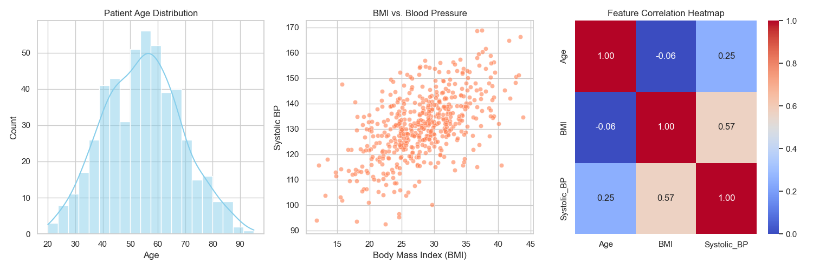
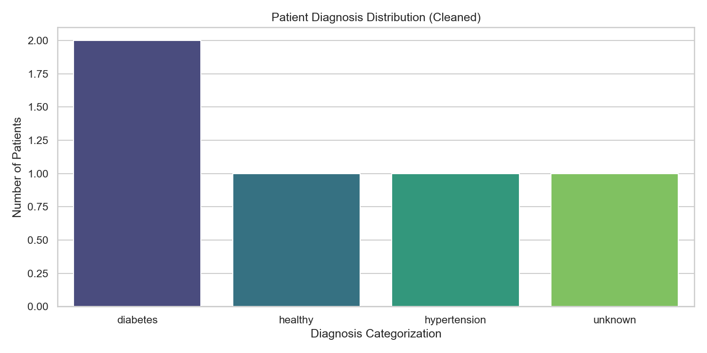
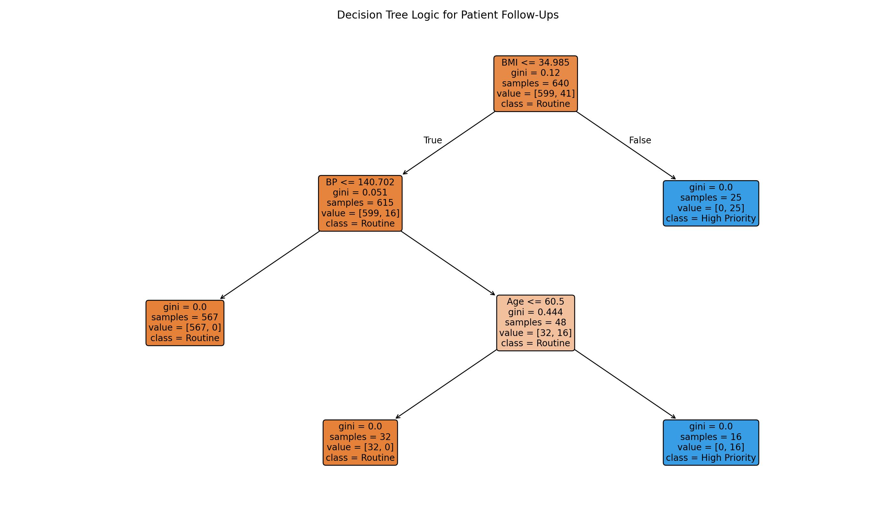
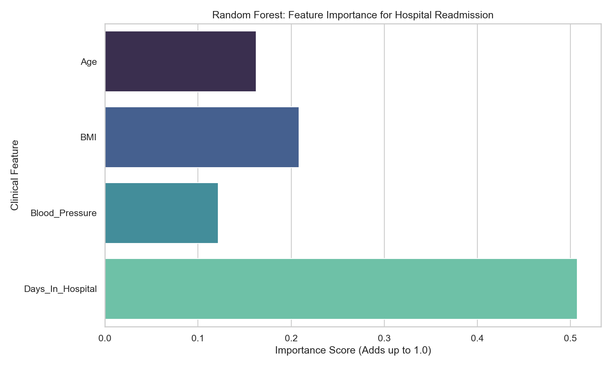
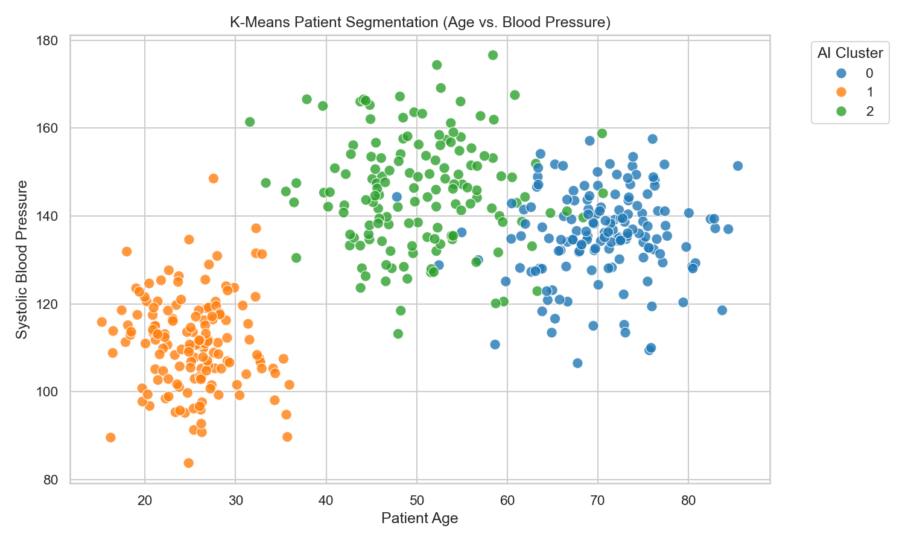
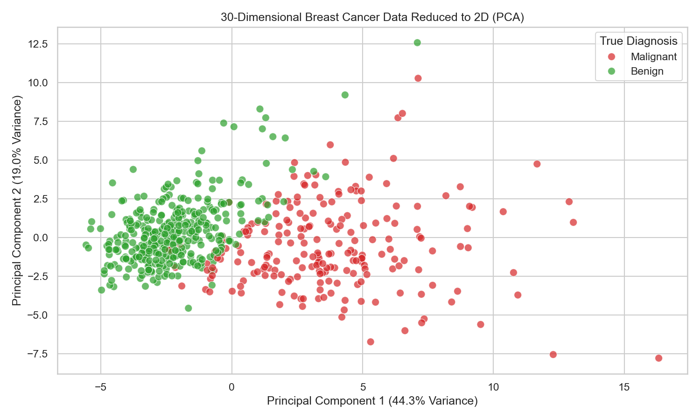

# 60-Day AIML Engineering Journey 🚀

This repository tracks my transition into an AIML Engineer.  
Built from scratch — focusing on a privacy-first, 100% local Retrieval-Augmented Generation (RAG) system running natively on Apple Silicon.

---

## 🛠 Tech Stack

| Category | Tools |
|---|---|
| **Hardware** | MacBook Pro M5 (16GB RAM, 512GB SSD) |
| **Shell** | Bash / Zsh |
| **Version Control** | Git, GitHub, `.gitignore` configuration |
| **Core ML Engines** | Apple MLX, PyTorch (Metal Performance Shaders) |
| **Data Engineering** | Python 3.11, NumPy, Pandas |
| **Data Visualization** | Matplotlib, Seaborn |
| **Classical ML** | Scikit-learn, XGBoost |
| **Vector Database** | ChromaDB |
| **Environment Management** | Python `venv`, pip requirements |
| **Editor** | VS Code (with Python & Jupyter extensions) |

---

## 📈 Learning Progress

## 🏗️ Phase 1: Environment & Mathematical Foundations (Days 1–10)

- [x] **Day 1:** Environment & Hardware Verification - Configure Python/VS Code and verify Apple MLX plus PyTorch MPS on Apple Silicon.
- [x] **Day 2:** Data Engineering Foundation - Generate synthetic clinical biomarkers with NumPy and clean/filter patient records with Pandas.
- [x] **Day 3:** Multi-Dimensional Matrices & Dot Products - Simulate semantic matching with Apple MLX.
- [x] **Day 4:** MLX Autograd & Calculus Engine - Calculate loss values and gradients for backpropagation intuition.
- [x] **Day 5:** Healthcare Dataset EDA - Load a local healthcare dataset with Pandas and inspect shape, preview rows, and missing values.
- [x] **Day 6:** Data Cleaning & RAG Text Serialization - Impute missing BMI values and convert patient rows into natural-language profiles.
- [x] **Day 7:** Local Vector Database - Initialize ChromaDB, embed patient profiles, and run semantic retrieval queries.
- [x] **Day 8:** MLX Backpropagation Engine - Train a simple weight with scalar loss, gradients, and gradient descent.
- [x] **Day 9:** Matplotlib & Seaborn EDA - Generate clinical summary statistics, distributions, scatter plots, and correlation heatmaps.
- [x] **Day 10:** Real-World Data Cleaning & EDA - Sanitize messy clinical records, impute missing values, remove outliers, and visualize diagnosis counts.

## 📊 Phase 2: Classical Machine Learning (Days 11–20)

- [x] **Day 11:** Linear Regression - Train a continuous blood pressure predictor with Scikit-learn.
- [x] **Day 12:** Logistic Regression - Train a binary hypertension classifier and inspect confusion matrix errors.
- [x] **Day 13:** Decision Trees - Train an interpretable priority follow-up classifier and visualize its split rules.
- [x] **Day 14:** Random Forests - Train an ensemble classifier for patient readmission and inspect feature importance.
- [x] **Day 15:** Gradient Boosting - Train an XGBoost diabetes-risk classifier with sequential tree boosting.
- [x] **Day 16:** Advanced XGBoost - Tune gradient boosting hyperparameters with randomized cross-validation.
- [x] **Day 17:** Unsupervised Learning - Segment unlabeled patients with K-Means clustering.
- [x] **Day 18:** Unsupervised Learning - Reduce high-dimensional medical data with Principal Component Analysis (PCA).
- [ ] **Day 19:** Model Evaluation - Mastering Precision, Recall, F1-score, and ROC-AUC.
- [ ] **Day 20:** ML Pipelines - Building an end-to-end scaling and training pipeline.

## 🧠 Phase 3: Deep Learning & Embeddings (Days 21–30)

- [ ] **Day 21:** PyTorch Fundamentals - Tensors and basic operations.
- [ ] **Day 22:** Multi-Layer Perceptron (MLP) - Building your first neural network.
- [ ] **Day 23:** Hardware Acceleration - Pushing tensors to the M5 GPU (`device = torch.device("mps")`).
- [ ] **Day 24:** Neural Network Training - Forward passes, loss functions, and backpropagation.
- [ ] **Day 25:** Transformers - Understanding self-attention architectures.
- [ ] **Day 26:** Hugging Face - Loading pre-trained models via the `transformers` library.
- [ ] **Day 27:** NLP Processing - Tokenization and text preparation.
- [ ] **Day 28:** Vectorization - Converting medical text into dense numerical vectors (embeddings).
- [ ] **Day 29:** Lightweight Models - Generating embeddings using small, efficient models.
- [ ] **Day 30:** Vector Databases - Spinning up a local ChromaDB instance for storage.

## 👁️ Phase 4: Vision & The MLX Engine (Days 31–40)

- [ ] **Day 31:** Native Computer Vision - Introduction to YOLO for object detection.
- [ ] **Day 32:** YOLO26-MLX - Implementing real-time vision natively on the Mac.
- [ ] **Day 33:** Medical Imaging - Applying vision to identify anomalies in scans.
- [ ] **Day 34:** Memory Optimization - Bypassing PyTorch overheads for Apple MLX efficiency.
- [ ] **Day 35:** The Apple MLX LLM - Introduction to local text generation.
- [ ] **Day 36:** Model Quantization - Understanding 16-bit to 4-bit compression for 16GB RAM limits.
- [ ] **Day 37:** Downloading Quantized Models - Using `mlx-lm`, such as Llama-3-8B-4bit.
- [ ] **Day 38:** Local Inference - Writing scripts to generate text natively.
- [ ] **Day 39:** Hardware Acceleration - Taking full advantage of the M5 neural engine.
- [ ] **Day 40:** Inference Optimization - Tuning generation parameters, including temperature and max tokens.

## ⚙️ Phase 5: Building Agentic RAG (Days 41–50)

- [ ] **Day 41:** Document Ingestion - Setting up a LangChain pipeline.
- [ ] **Day 42:** PDF Parsing - Reading and extracting text from clinical PDFs.
- [ ] **Day 43:** Chunking - Splitting documents into optimized semantic chunks.
- [ ] **Day 44:** Embedding Generation - Batch processing chunks into vectors.
- [ ] **Day 45:** Vector Storage Setup - Initializing the RAG database.
- [ ] **Day 46:** Populating ChromaDB - Inserting chunked embeddings securely.
- [ ] **Day 47:** Semantic Search - Querying the database for nearest neighbors.
- [ ] **Day 48:** Orchestration Logic - Programming the agentic retrieval step.
- [ ] **Day 49:** LLM Integration - Instructing the MLX LLM to read chunks and formulate answers.
- [ ] **Day 50:** RAG Fusion - End-to-end testing of the question-answering loop.

## 🚀 Phase 6: Fine-Tuning, UI & Deployment (Days 51–60)

- [ ] **Day 51:** PEFT & LoRA - Introduction to Parameter-Efficient Fine-Tuning.
- [ ] **Day 52:** Corporate Jargon - Preparing a dataset of specific medical terminology.
- [ ] **Day 53:** MLX Fine-Tuning - Running LoRA on the quantized model within 16GB limits.
- [ ] **Day 54:** Merging Weights - Applying the LoRA adapters to the base model.
- [ ] **Day 55:** User Interface - Introduction to Streamlit.
- [ ] **Day 56:** UI Development - Building a modern browser-based chat interface.
- [ ] **Day 57:** UI Integration - Connecting the Streamlit frontend to the RAG backend.
- [ ] **Day 58:** Profiling - Reviewing memory usage across the complete pipeline.
- [ ] **Day 59:** Optimization - Tweaking chunk sizes and prompts to maximize M5 generation speed.
- [ ] **Day 60:** Shipping - Finalizing `README.md` documentation and pushing to GitHub.

---

## ✅ Current Status

Day 18 is complete. Phase 2 now includes supervised learning, ensemble methods, gradient boosting, clustering, and dimensionality reduction. The project now has:

- `day1_test_env.py` for validating Apple Silicon ML acceleration with PyTorch MPS and Apple MLX.
- `day2_data_engine.py` for generating synthetic patient biomarker data, imputing missing clinical fields, and filtering high-risk hypertension records.
- `day3_vector_math.py` for simulating clinical semantic similarity with dot products and MLX matrix multiplication.
- `day4_calculus_engine.py` for validating MLX autograd by calculating a loss function gradient.
- `day5_eda.py` for running exploratory data analysis on the local healthcare dataset.
- `day6_data_cleaning.py` for imputing missing BMI values and creating patient text profiles for future RAG embeddings.
- `day7_vector_db.py` for initializing a local ChromaDB collection and retrieving semantically similar patient profiles.
- `day8_calculus_engine.py` for demonstrating MLX autograd, scalar loss calculation, and gradient descent updates.
- `day9_eda.py` for generating synthetic clinical EDA summaries with Matplotlib and Seaborn visualizations.
- `day10_real_eda.py` for cleaning messy real-world-style clinical data and visualizing cleaned diagnosis distributions.
- `day11_linear_regression.py` for training and evaluating a Scikit-learn linear regression model on synthetic patient blood pressure data.
- `day12_logistic_regression.py` for training a Scikit-learn logistic regression classifier and analyzing true/false positives and negatives.
- `day13_decision_trees.py` for training a Scikit-learn decision tree classifier and visualizing the learned clinical split logic.
- `day14_random_forest.py` for training a Scikit-learn random forest readmission classifier and plotting feature importances.
- `day15_xgboost_classifier.py` for training an XGBoost diabetes-risk classifier and testing an edge-case patient.
- `day16_xgboost_tuning.py` for tuning an XGBoost regressor with randomized search and cross-validation.
- `day17_kmeans_clustering.py` for segmenting unlabeled patients into discovered clinical clusters with K-Means.
- `day18_pca_reduction.py` for reducing 30-dimensional medical measurements into two principal components for visualization.
- `Figure_1.png` as the Day 9 EDA dashboard image with an age histogram, BMI/BP scatter plot, and correlation heatmap.
- `Figure_2.png` as the Day 10 cleaned diagnosis count chart.
- `Decision_Tree.jpeg` and `Figure_3.png` as Day 13 decision tree visualization artifacts.
- `Figure_4.png` as the Day 14 random forest feature-importance chart.
- `Figure_5.png` as the Day 17 K-Means patient segmentation chart.
- `Figure_6.png` as the Day 18 PCA dimensionality-reduction chart.
- `healthcare_dataset.csv` as the local source dataset used by the Day 5 and Day 6 scripts.
- `cleaned_healthcare_data.csv` as the cleaned Day 6 output dataset with serialized patient profiles.
- `requirements.txt` with the Day 1 through Day 18 Python dependencies.

## 📂 Project Highlights

### ⚙️ Day 1 Hardware Verification (`day1_test_env.py`)

A sanity check script ensuring PyTorch communicates with the M5 GPU (MPS) and Apple MLX is successfully initialized.

```bash
python day1_test_env.py
# --- Apple Silicon Hardware Test ---
# ✅ PyTorch is successfully utilizing the M5 GPU (MPS).
# ✅ Apple MLX is installed and functioning.
```

---

### 🧬 Clinical Data Engine (`day2_data_engine.py`)

Simulates clinical dataset manipulation for future RAG ingestion. Demonstrates fast NumPy array processing for patient biomarkers and Pandas DataFrame imputation for missing values in clinical notes.

```bash
python day2_data_engine.py
# --- Day 2: Clinical Data Engineering Engine ---
#
# Step 1: Raw NumPy Biomarker Matrix (Shape: 5x3):
# [[148 138 124] ... ]
#
# Step 3: Imputed missing ages with median (48.5):
#     Patient_ID   Age     Condition                                     Clinical_Notes
# 0          101  45.0  Hypertension  Patient exhibits elevated resting systolic pressure.
#
# Step 4: Filtered High-Risk Hypertension Patients:
#     Patient_ID   Age                                     Clinical_Notes
# 0          101  45.0  Patient exhibits elevated resting systolic pressure.
# 3          104  61.0              Severe chronic hypertension tracking.
```

---

### 🧮 Clinical Vector Math (`day3_vector_math.py`)

Simulates semantic matching for clinical terms using Apple MLX vectors, dot products, and matrix multiplication. This is the foundation for future embedding search and local RAG retrieval.

```bash
python day3_vector_math.py
# --- Day 3: Clinical Semantics & Matrix Engines ---
#
# Dot Product (Hypertension vs Blood Pressure): 0.74
# Dot Product (Hypertension vs Diabetes):       0.17
#
# Step 3: MLX Accelerated Patient Diagnosis Matrix (Patients x Diseases):
# array([[0.779552, 0.204833],
#        [0.134952, 0.729741]], dtype=float32)
```

---

### 📉 MLX Calculus Engine (`day4_calculus_engine.py`)

Uses Apple MLX autograd to calculate the value and gradient of a simple loss function. This connects calculus basics to the mechanism behind neural network backpropagation.

```bash
python day4_calculus_engine.py
# --- MLX Calculus Engine ---
# Input value (x): 2.0
# Calculated Loss: 17.0
# Calculated Gradient (Rate of Change): 14.0
```

---

### 📊 Healthcare Dataset EDA (`day5_eda.py`)

Loads the local healthcare dataset with Pandas, confirms the record and feature counts, previews patient rows, and checks for missing values before future cleaning and modeling steps.

```bash
python day5_eda.py
# --- Healthcare Dataset EDA Engine (Local) ---
# Dataset successfully loaded from local file!
#
# Total Patient Records (Rows): 5110
# Total Features (Columns): 12
#
# --- Missing Data Check ---
# Warning: Missing data found in the following columns:
# bmi    201
```

---

### 🧹 Healthcare Data Cleaning (`day6_data_cleaning.py`)

Imputes missing BMI values with the median, verifies that no BMI nulls remain, and serializes each patient record into a natural-language profile suitable for later embedding and RAG retrieval work.

```bash
python day6_data_cleaning.py
# --- Healthcare Data Cleaning Pipeline ---
# Fixed 201 missing values by imputing the median BMI: 28.1
# Missing BMI values remaining: 0
#
# Converting patient records into text profiles...
# Success! Cleaned data saved to: cleaned_healthcare_data.csv
```

---

### 🔎 Local Vector Database (`day7_vector_db.py`)

Initializes an in-memory ChromaDB collection, embeds sample patient profiles, and performs semantic search with a natural-language query to simulate the retrieval layer of a future RAG assistant.

```bash
python day7_vector_db.py
# --- Day 7: ChromaDB Vector Engine Initialization ---
#
# Embedding and loading patient records into Vector Database...
# Records successfully stored in ChromaDB.
#
# Searching Vector DB for: 'elderly patients struggling with high blood pressure'
# Top 2 Semantic Matches Found:
# Match 1: Patient 101 ... Diagnosed with Hypertension.
# Match 2: Patient 102 ... Severe chronic hypertension tracking.
```

---

### 📐 MLX Backpropagation Engine (`day8_calculus_engine.py`)

Trains a simple one-weight model with MLX autograd. The script computes mean squared error as a scalar loss, reads the gradient with `mx.value_and_grad`, and updates the weight through gradient descent until it approaches the ideal value.

```bash
python day8_calculus_engine.py
# --- Day 8: MLX Autograd & Backpropagation Engine ---
#
# Starting Training Loop...
# Epoch 01 | Weight: 1.0000 | Loss: 64.0000 | Gradient (Slope): -32.0000
# Epoch 10 | Weight: 4.9597 | Loss: 0.0065 | Gradient (Slope): -0.3225
#
# Training Complete. The model optimized the weight to: 4.9758 (Ideal is 5.000)
```

---

### 📊 Clinical EDA Dashboard (`day9_eda.py`)

Generates a synthetic clinical dataset, prints summary statistics, and builds a three-panel EDA dashboard with patient age distribution, BMI versus systolic blood pressure, and a feature correlation heatmap.



```bash
python day9_eda.py
# --- Day 9: Healthcare Exploratory Data Analysis (EDA) ---
#
# Dataset Summary Statistics:
#          Age     BMI  Systolic_BP
# count  496.00  496.00       496.00
# mean    54.57   28.15       131.20
#
# Generating Visualizations... Check your taskbar/dock for new windows!
```

---

### 🧼 Real-World Data Cleaning EDA (`day10_real_eda.py`)

Simulates a messy Kaggle-style clinical CSV, inspects raw issues, standardizes diagnosis labels, removes impossible age outliers, imputes missing age and blood pressure values, and saves a cleaned diagnosis distribution chart.



```bash
python day10_real_eda.py
# --- Day 10: Real-World Data Cleaning & EDA ---
#
# RAW DATA includes impossible ages, NaNs, and inconsistent diagnosis casing.
# CLEANED DATA keeps valid patients, standardizes labels, and fills missing values.
#
# Generating chart... Saved to: Figure_2.png
```

---

### 📈 Linear Regression Predictor (`day11_linear_regression.py`)

Generates synthetic patient age, BMI, and systolic blood pressure data, splits the dataset into training and testing sets, trains a Scikit-learn `LinearRegression` model, evaluates prediction error, and runs inference for a new patient.

```bash
python day11_linear_regression.py
# --- Day 11: Linear Regression Prediction Model ---
#
# Data Split: 800 Training Patients | 200 Testing Patients
# Learned Weights -> Age Multiplier: 0.39, BMI Multiplier: 1.06
# Evaluation: On average, the model's predictions are off by 3.63 mmHg.
# Predicted Systolic Blood Pressure: 133.1
```

---

### 🧪 Logistic Regression Classifier (`day12_logistic_regression.py`)

Generates synthetic patient risk data, scales age, BMI, and heart-rate features, trains a Scikit-learn `LogisticRegression` classifier, evaluates accuracy, and breaks down confusion matrix errors for hypertension classification.

```bash
python day12_logistic_regression.py
# --- Day 12: Logistic Regression Classifier ---
#
# Dataset Balance: 731 patients with Hypertension, 269 Healthy
# Overall Model Accuracy: 84.50%
# True Negatives: 39 | False Positives: 18
# False Negatives: 13 | True Positives: 130
# Prediction: Healthy
# AI Confidence (Probability): 32.6%
```

---

### 🌳 Decision Tree Classifier (`day13_decision_trees.py`)

Generates synthetic clinical follow-up data, trains a `DecisionTreeClassifier` without feature scaling, evaluates priority follow-up classification accuracy, and saves a visual tree diagram showing the model's split logic.



```bash
python day13_decision_trees.py
# --- Day 13: Decision Tree Classifier ---
#
# Dataset: 49 patients flagged for priority follow-up.
# Model Accuracy: 100.00%
# Saved tree visualizations to: Decision_Tree.jpeg and Figure_3.png
```

---

### 🌲 Random Forest Classifier (`day14_random_forest.py`)

Generates synthetic hospital readmission data, trains a 100-tree `RandomForestClassifier`, evaluates readmission classification performance, and saves a feature-importance chart showing which clinical variables the ensemble relied on most.



```bash
python day14_random_forest.py
# --- Day 14: Random Forest Classifier (Patient Readmission) ---
#
# Dataset: 335 patients were readmitted out of 1200.
# Forest Accuracy: 74.17%
# Healthy f1-score: 0.83 | Readmitted f1-score: 0.44
# Saved feature importance chart to: Figure_4.png
```

---

### ⚡ XGBoost Classifier (`day15_xgboost_classifier.py`)

Generates synthetic diabetes-risk data, trains an `XGBClassifier` with sequential gradient-boosted trees, evaluates the classifier, and runs inference on an edge-case patient with high blood sugar and BMI.

```bash
python day15_xgboost_classifier.py
# --- Day 15: XGBoost Classifier (Diabetes Risk Prediction) ---
#
# Dataset: 238 patients diagnosed out of 1500.
# XGBoost Accuracy: 83.67%
# Healthy f1-score: 0.91 | Diabetic f1-score: 0.20
# Prediction: Diabetic Risk
# AI Confidence (Probability): 64.4%
```

On macOS, XGBoost also needs the OpenMP runtime:

```bash
brew install libomp
```

---

### 🎛️ XGBoost Hyperparameter Tuning (`day16_xgboost_tuning.py`)

Generates synthetic treatment-cost data, trains a baseline `XGBRegressor`, then uses `RandomizedSearchCV` with cross-validation to find stronger hyperparameters and reduce average prediction error.

```bash
python day16_xgboost_tuning.py
# --- Day 16: Advanced XGBoost & Hyperparameter Tuning ---
#
# Baseline Error: Off by $2,347.03 per patient on average.
# Best parameters: n_estimators=100, max_depth=3, learning_rate=0.05
# Tuned Model Error: Off by $2,134.00 per patient on average.
# Financial Impact: Tuning saved $213.03 of error per prediction.
```

---

### 🧩 K-Means Patient Clustering (`day17_kmeans_clustering.py`)

Generates unlabeled clinical vitals, scales the features, uses `KMeans` to discover three hidden patient segments, summarizes each cluster's average vitals, and saves a 2D segmentation chart.



```bash
python day17_kmeans_clustering.py
# --- Day 17: Unsupervised Learning (K-Means Clustering) ---
#
# Received raw data for 450 patients. No diagnoses provided!
# Cluster 0: Age 70.5 | BMI 25.0 | Blood Pressure 135.7
# Cluster 1: Age 25.4 | BMI 21.8 | Blood Pressure 110.9
# Cluster 2: Age 50.4 | BMI 32.1 | Blood Pressure 145.5
# Saved cluster visualization to: Figure_5.png
```

---

### 🧬 PCA Dimensionality Reduction (`day18_pca_reduction.py`)

Loads Scikit-learn's breast cancer dataset, scales 30 tumor-measurement features, compresses them into two principal components, reports retained variance, and saves a 2D diagnosis visualization.



```bash
python day18_pca_reduction.py
# --- Day 18: Dimensionality Reduction with PCA ---
#
# Loaded Dataset Shape: 569 patients with 30 distinct dimensions.
# PCA successfully reduced 30 dimensions to 2.
# The new 2D graph retains 63.24% of the original complex information.
# Saved PCA visualization to: Figure_6.png
```

---

## 💻 Local AI Execution & Validation

```bash
# 1. Create and activate isolated Python environment
python3 -m venv .venv
source .venv/bin/activate

# 2. Install Day 1 through Day 18 dependencies
python -m pip install --upgrade pip
python -m pip install -r requirements.txt

# macOS only: install the OpenMP runtime required by XGBoost
brew install libomp

# 3. Run hardware verification
python day1_test_env.py

# 4. Run data engineering simulation
python day2_data_engine.py

# 5. Run clinical vector math simulation
python day3_vector_math.py

# 6. Run MLX autograd/calculus simulation
python day4_calculus_engine.py

# 7. Run healthcare dataset EDA
python day5_eda.py

# 8. Run healthcare data cleaning and text serialization
python day6_data_cleaning.py

# 9. Run local ChromaDB semantic retrieval
python day7_vector_db.py

# 10. Run MLX backpropagation training loop
python day8_calculus_engine.py

# 11. Run Matplotlib and Seaborn EDA dashboard
python day9_eda.py

# 12. Run real-world data cleaning and EDA charting
python day10_real_eda.py

# 13. Run linear regression blood pressure prediction
python day11_linear_regression.py

# 14. Run logistic regression hypertension classification
python day12_logistic_regression.py

# 15. Run decision tree priority follow-up classification
python day13_decision_trees.py

# 16. Run random forest hospital readmission classification
python day14_random_forest.py

# 17. Run XGBoost diabetes risk classification
python day15_xgboost_classifier.py

# 18. Run XGBoost hyperparameter tuning
python day16_xgboost_tuning.py

# 19. Run K-Means patient clustering
python day17_kmeans_clustering.py

# 20. Run PCA dimensionality reduction
python day18_pca_reduction.py

# Verify clean git tracking (ignoring .venv)
git status
```

---

## 🎯 Target Roles

AIML Engineer · ML Ops Engineer · GenAI Developer

---

*Built with 💻 + 🧠 by Dipendu Mukherjee — one day at a time.*
